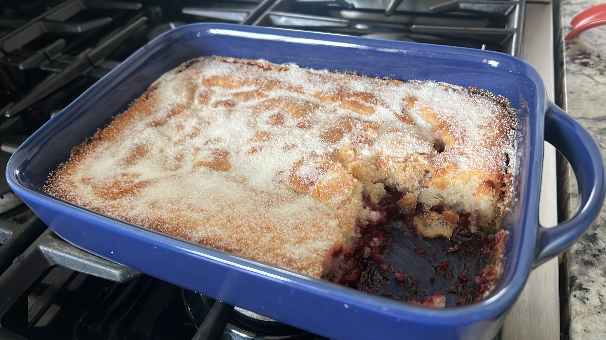

# Blackberry Cobbler
This easy Blackberry Cobbler recipe from The Pioneer Woman takes just 5 ingredients and 10 minutes to prepare. It’s got a sweet, 
juicy filling and a sugary golden crust!  https://thecozycook.com/blackberry-cobbler/.  

Baked Cobbler can be covered and stored at room temperature for up to 3 days, or in the refrigerator for up to a week.  
A  9 x 9 inch pan works well for this recipe. If using a 9 x 13 pan, consider doubling the recipe for thicker results.

 

 

## Ingredients
- Sugar (1 cup + 2 tablespoons)
- Self Rising Flour (1 cup)
- Whole Milk (1 cup)
- Butter (1/2 Stick)
- Blackberries– fresh or frozen (2 cups)
  - Frozen berries work well in this recipe as well, be sure to add them when they’re frozen. If you let them thaw, they’ll be mushy and the consistency will be off.
- Vanilla Ice Cream– for serving, optional

## Instructions
1. Heat oven to 350 degrees.
2. Combine the 1 cup sugar and 1 cup self-rising flour. Add 1 cup whole milk and 1/2 stick melted butter.
3. Add to a (9 x 9) casserole dish and top with 2 cups blackberries.
4. Sprinkle 1/4 cup sugar on top and bake at 350° F for 50 minutes.
5. Add 2 Tablespoons sugar and bake for 10 more minutes.
6. Serve with vanilla ice scream and serve.

 

## Nutrition
- HA!