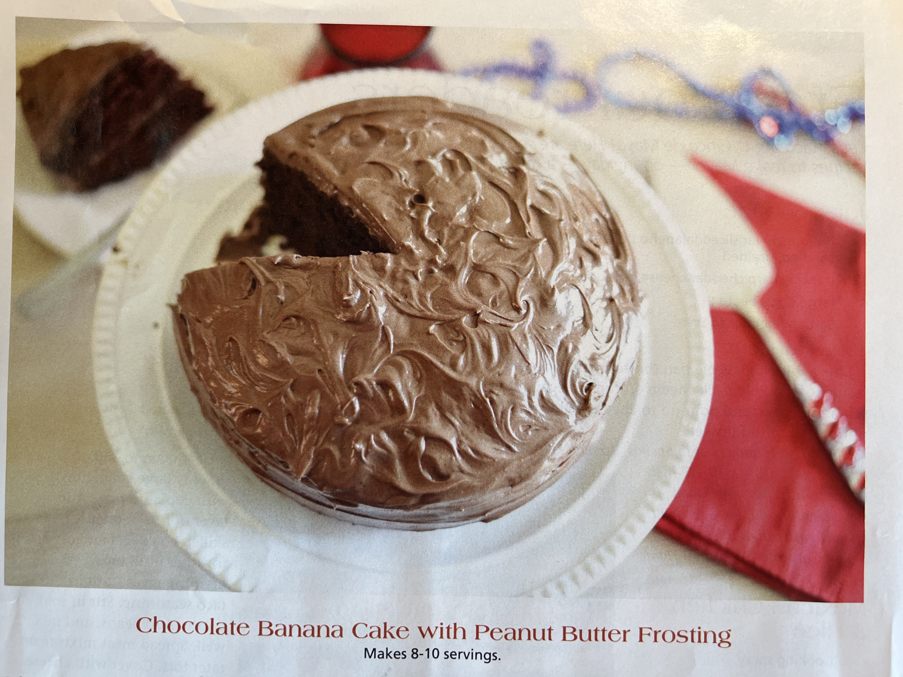

# Chocolate Banana Cake with Peanut Butter Frosting
Yields two servings. Prep / cook time: 15 minutes.

 

 

## Ingredients
- **Cake**
  - 1 cup sugar
  - 2 cups cake flour, sifted
  - 1/3 cup cocoa powder
  - 1 1/2 teaspoons baking soda
  - 1 teaspoon backing powder
  - Pinch of salt
  - 2 large very ripe bananas, mashed
  - 1 cup canola oil
  - 1/2 cup chocolate milk
  - 3 eggs, whisked 

- **Frosting**
  - 1/2 cup peanut butter
  - 4 tablespoons unsalted butter, softened
  - 1 teaspoon vanilla extract
  - 1/4 cup cocoa powder
  - 3 cups powdered sugar
  - 1/2 cup warm water
  - Banana slices (optional garnish)

## Instructions
- **Cake** 
1. Heat oven to 350 degrees
2. Grease two 9-inch cake pans; set aside
3. In a large bowl, whisk together sugar, flour, cocoa powder, baking soda, baking powder, and salt
4. Add bananas, canola oil, chocolate milk, and eggs
5. Using an electric mixer, beat until thoroughly combined, scraping down sides of bowl
6. Evenly pour batter into prepared pans
7. Bake for 29 - 32 minutes or until a toothpick inserted in center comes out clean
8. Allow cake to cool completely before frosting

- **Frosting**
1. Beat together peanut butter and butter in a large bowl
2. Add vanilla extract and cocoa powder
3. Gradually beat in powdered sugar and water
4. If frosting is too thick for your liking, add extra water. (1 tablespoon at a time)

- **Combination of cake and frosting**
1. Spread top of one cooled cake layer with frosting
2. Top with second cake layer
3. Frost cake
4. If desired, top with banana slices
5. Serve
6. Refrigerate leftovers covered in plastic wrap

## Nutrition
- HA!